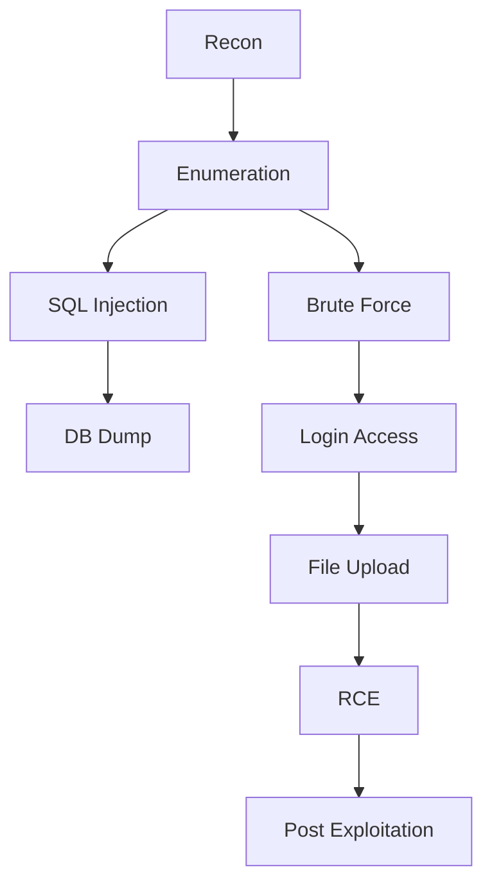

##  Overview

This project demonstrates a full Vulnerability Assessment and Penetration Test (VAPT) conducted against DVWA using PTES methodology.

- Target: DVWA Web Application  
- IP: 10.236.92.45  
- Port: 8080  
- Testing Type: Black Box  
- Tester: Rohit Kumar Bid  
- Duration: March 23 – March 27, 2026  

##  Executive Summary

A security assessment identified 5 vulnerabilities:
- 3 Critical
- 2 High

Key risks include SQL Injection, Remote Code Execution, and credential compromise.

## PTES Methodology

### 1. Intelligence Gathering
- Nmap scan identified:
  - 111 (RPC)
  - 902 (VMware)
  - 2049 (NFS)
  - 8080 (HTTP - DVWA)

### 2. Application Mapping
- /login.php
- /vulnerabilities/sqli/
- /vulnerabilities/xss_r/
- /vulnerabilities/xss_s/
- /vulnerabilities/csrf/
- /vulnerabilities/brute/
- /vulnerabilities/upload/

## 3. Threat Modeling

### Attack Surface

- Publicly accessible web application
- Input fields vulnerable to injection
- Weak authentication mechanisms

### Identified Risks

- Injection attacks (SQLi)
- Authentication bypass
- Remote Code Execution
- Session hijacking

## 4. Vulnerability Analysis

|Vulnerability|Severity|CVSS|
|---|---|---|
|SQL Injection|Critical|9.8|
|File Upload (RCE)|Critical|9.8|
|Brute Force|Critical|9.1|
|CSRF|High|8.1|
|XSS|High|8.1|

## 5. Exploitation

### Initial Access

- SQL Injection used to extract database contents
- Brute force attack used to obtain credentials:
    - admin : password

### Privilege Escalation

- File upload vulnerability exploited to upload PHP shell

### Remote Code Execution

http://10.236.92.45:8080/hackable/uploads/shell.php?cmd=id

Output:

uid=33(www-data) gid=33(www-data)

## 6. Post-Exploitation

- Retrieved sensitive files (`/etc/passwd`)
- Enumerated system users
- Verified command execution capability
- Established shell access

## 7. Reporting

### Findings Summary

- Total Findings: 5
- Critical: 3
- High: 2

### Business Impact

- Full system compromise possible
- Sensitive data exposure
- Unauthorized access
- Remote command execution

## ⚔️ Exploitation Flow

##  Remediation

Short-Term:
- Input validation
- Rate limiting
- CSRF tokens

Medium-Term:
- MFA
- Secure coding

Long-Term:
- Secure SDLC
- WAF
- Regular testing

##  References
- OWASP Top 10
- CWE-89, CWE-434, CWE-79, CWE-352

##  Author
Rohit Kumar Bid
