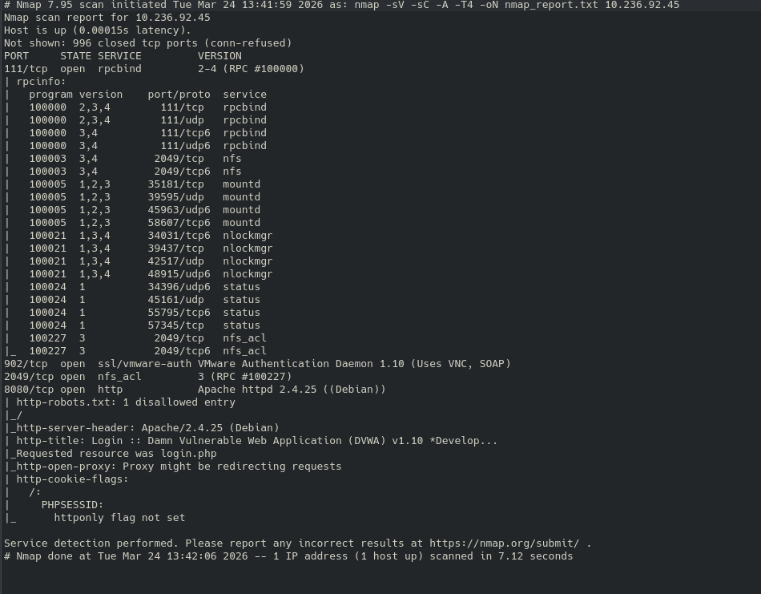

## Overview

-   Target IP: 10.236.92.45
-   Tool Used: Nmap
-   Scan Type: Service Detection + Default Scripts + Aggressive Scan

Command Used: nmap -sV -sC -A -T4 -oN nmap_report.txt 10.236.92.45

## Scan Summary

-   Host is UP
-   Latency: 0.00015s
-   Total Ports Scanned: 1000
-   Open Ports: 4

## Open Ports & Services

## Findings

### RPC Service (111)

-   Exposes multiple RPC services
-   Risk: Enumeration and access to internal services

### VMware Auth (902)

-   Risk: Brute-force and remote access attempts

### NFS (2049)

-   Risk: Unauthorized file access if misconfigured

### Web Server (8080)

-   Apache 2.4.25 (Debian)
-   DVWA login page detected

Issue: - Missing HttpOnly flag in cookies → session hijacking risk

## Recommendations

-   Disable unnecessary services
-   Restrict VMware access
-   Secure NFS configuration
-   Enable HttpOnly cookies
-   Update Apache server

## Conclusion

Multiple exposed services increase attack surface. Hardening required.
