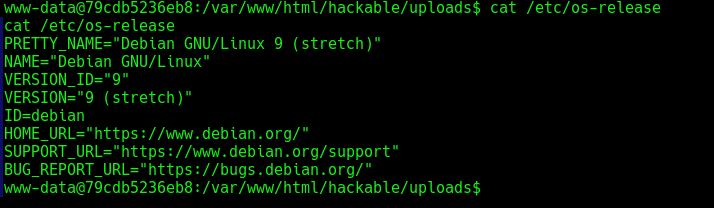
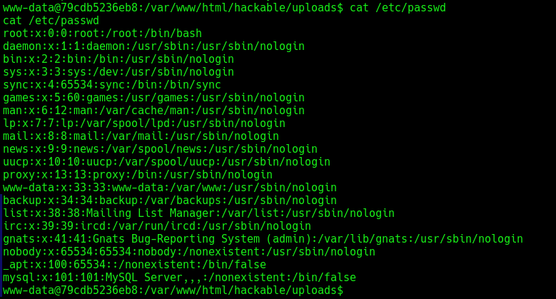

## Operating System Information

Command: cat /etc/os-release

## Sensitive File Access --- /etc/passwd

Command: cat /etc/passwd

## Security Observations

-   User enumeration successful
-   Access to system-level files confirmed
-   Potential privilege escalation vectors identified

## Conclusion

Post-exploitation access successfully achieved with sensitive data
exposure.
