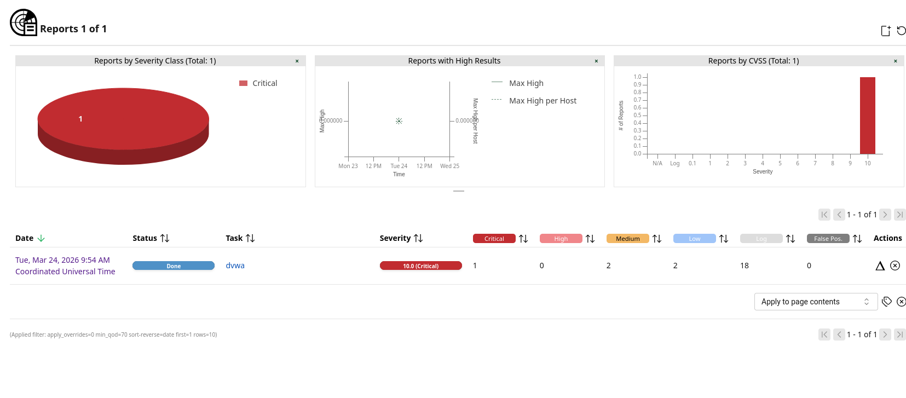

##  Overview

-   **Target:** 10.236.92.45
-   **Tool Used:** OpenVAS
-   **Scan Date:** March 24, 2026
-   **Assessment Type:** Automated Vulnerability Scan

## Scan Summary

  Severity   Count

  Critical   1
  High       0
  Medium     2
  Low        2

## Critical Vulnerability

### OS End of Life (EOL) --- Debian 9

-   **CVSS Score:** 10.0 (Critical)

-   **Description:**
    The target system is running Debian GNU/Linux 9 (Stretch), which has
    reached end-of-life and no longer receives security updates.

-   **Impact:**

    -   No vendor patches available
    -   High risk of exploitation
    -   System compromise possible
-   **Recommendation:**
    Upgrade the operating system to a supported version.

##  Medium Vulnerabilities

### 1. Missing HttpOnly Cookie Attribute

-   **CVSS Score:** 5.0

-   **Description:**
    Session cookies are missing the HttpOnly flag.

-   **Impact:**

    -   Cookies accessible via JavaScript
    -   Risk of session hijacking

-   **Recommendation:**
    Enable HttpOnly flag for all session cookies.

### 2. Cleartext Transmission of Sensitive Data

-   **CVSS Score:** 4.8

-   **Description:**
    Sensitive data is transmitted over HTTP instead of HTTPS.

-   **Impact:**

    -   Susceptible to Man-in-the-Middle (MITM) attacks\
    -   Credentials can be intercepted

-   **Recommendation:**
    Enforce HTTPS and use SSL/TLS encryption.

## Low Vulnerabilities

### 1. TCP Timestamp Disclosure

-   **CVSS Score:** 2.6

-   **Description:**
    TCP timestamps allow attackers to estimate system uptime.

-   **Recommendation:**
    Disable TCP timestamps in system configuration.

### 2. ICMP Timestamp Disclosure

-   **CVSS Score:** 2.1

-   **Description:**
    ICMP timestamp responses reveal system time information.

-   **Recommendation:**
    Disable ICMP timestamp responses or block via firewall.

##  Conclusion

The scan identified a critical vulnerability due to an outdated
operating system, along with multiple medium and low risks.

Immediate action is required to: - Upgrade the OS
- Secure communication channels
- Harden system configurations

Failure to remediate may lead to system compromise.
