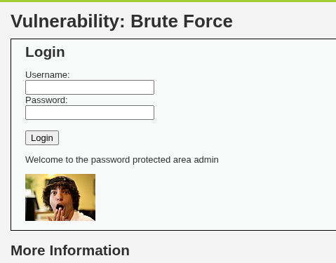

## Overview

- **Application:** DVWA (Damn Vulnerable Web Application)
- **Vulnerability:** Brute Force Attack
- **Location:** /vulnerabilities/brute/
- **Severity:** High
- **CVSS Score:** 8.0 (AV:N/AC:L/PR:N/UI:N/S:U/C:H/I:H/A:N)


## Description

The application is vulnerable to brute force attacks due to the absence of proper authentication controls such as account lockout, rate limiting, or CAPTCHA.

An attacker can repeatedly attempt different username/password combinations to gain unauthorized access.


##  Affected Endpoint

http://10.236.92.45:8080/vulnerabilities/brute/


## Proof of Concept (PoC)

###  Step 1 — Identify Login Request

```http
GET /dvwa/vulnerabilities/brute/?username=admin&password=pass&Login=Login HTTP/1.1
```


### Step 2 — Perform Brute Force

Payloads:

```
username=admin&password=123456
username=admin&password=password
username=admin&password=admin
```


###  Step 3 — Successful Login

Valid credentials discovered:

```
Username: admin
Password: password
```




## Impact

- Unauthorized account access
- Credential compromise
- Account takeover


##  Root Cause

- No rate limiting
- No account lockout
- Weak password policy
- No CAPTCHA implementation


## Remediation

###  Account Lockout
- Lock account after multiple failed attempts

###  Rate Limiting
- Limit number of login attempts per IP

###  CAPTCHA
- Prevent automated attacks

###  Strong Password Policy
- Enforce complexity requirements

###  Multi-Factor Authentication (MFA)
- Add additional authentication layer


## Exploitation Flow

1. Identify login form
2. Capture request
3. Automate password attempts
4. Detect successful response
5. Gain unauthorized access


## Tools Used

- Burp Suite (Intruder)
- Hydra
- Browser (Manual Testing)


## Risk Rating

| Metric        | Value |
|--------------|--------|
| Severity     | High |
| Exploitability | Easy |
| Impact       | High |


## References

- OWASP Top 10 — A07: Identification and Authentication Failures
- https://owasp.org/www-community/attacks/Brute_force_attack


## Conclusion

The application is vulnerable to brute force attacks due to lack of authentication protections. Attackers can easily compromise user accounts using automated tools.


