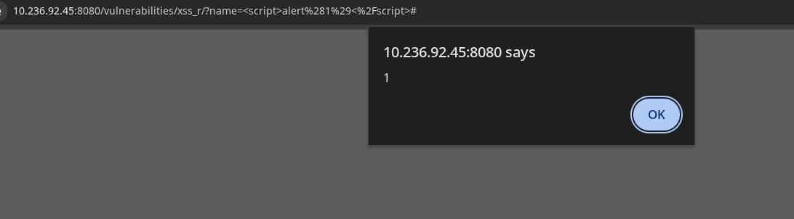
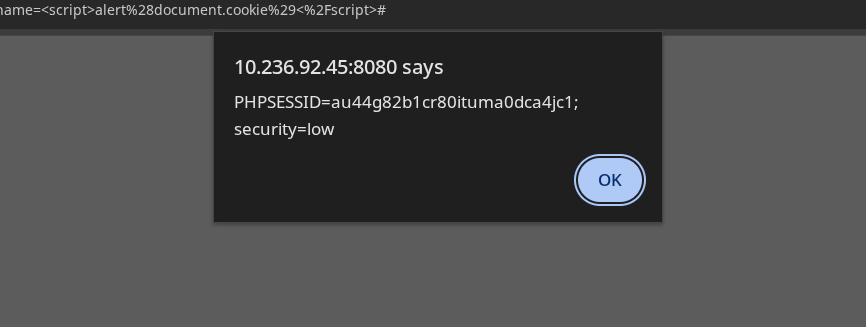
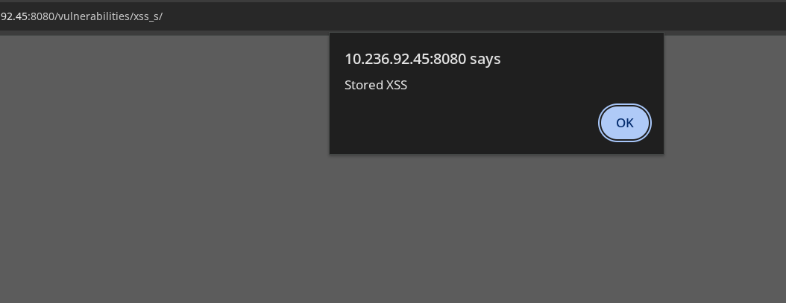

## Overview

- **Application:** DVWA (Damn Vulnerable Web Application)
- **Vulnerability:** Cross-Site Scripting (XSS)
- **Type:** Reflected / Stored (based on module)
- **Location:** /vulnerabilities/xss_r/ , /vulnerabilities/xss_s/
- **Severity:** High
- **CVSS Score:** 8.2 (AV:N/AC:L/PR:N/UI:R/S:U/C:H/I:H/A:N)

##  Description

A Cross-Site Scripting (XSS) vulnerability exists in DVWA where user input is not properly sanitized before being rendered in the browser.

This allows attackers to inject malicious JavaScript that executes in the victim’s browser.


##  Affected Endpoints

Reflected XSS:
http://10.236.92.45:8080/vulnerabilities/xss_r/

Stored XSS:
http://10.236.92.45:8080/vulnerabilities/xss_s/


##  Proof of Concept (PoC)

### Step 1 — Basic XSS Test

```html
<script>alert(1)</script>
```




### Step 2 — Reflected XSS

```html
<script>alert(document.cookie)</script>
```




### Step 3 — Stored XSS

```html
<script>alert('Stored XSS')</script>
```




## Impact

- Session hijacking
- Credential theft
- Unauthorized actions on behalf of user
- Persistent attacks (stored XSS)


## Root Cause

- Lack of input validation
- No output encoding
- Direct rendering of user input in HTML


##  Remediation

### Input Validation
- Reject malicious scripts
- Use allowlists

### Output Encoding
```html
&lt;script&gt;alert(1)&lt;/script&gt;
```

### Use Security Headers
- Content-Security-Policy (CSP)
- X-XSS-Protection

### Framework Protections
- Use built-in escaping (React, Angular, etc.)


##  Exploitation Flow

1. Identify input field
2. Inject JavaScript payload
3. Observe execution in browser
4. Escalate to cookie/session theft


## Tools Used

- Browser (Manual Testing)
- Burp Suite

## Risk Rating

| Metric        | Value |
|--------------|--------|
| Severity     | High |
| Exploitability | Easy |
| Impact       | High |

##  References

- OWASP Top 10 — A03: XSS
- https://owasp.org/www-community/attacks/xss/


## Conclusion

The application is vulnerable to Cross-Site Scripting due to improper handling of user input. Attackers can execute arbitrary JavaScript in the victim’s browser, leading to session compromise and data theft.

